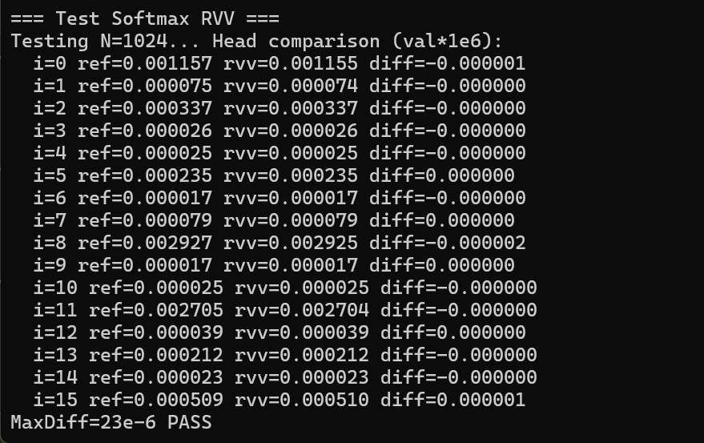
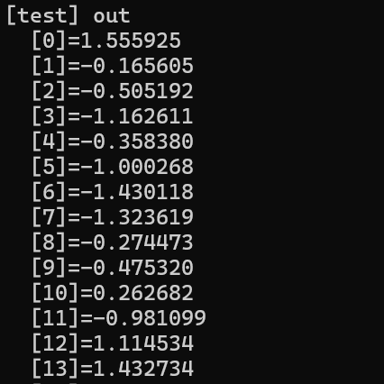

## 组内编译器安装方法

### 软件栈编译器仓库链接：

https://gitlink.org.cn/michaelcjl/llvm-project_riscv

### 安装方法：

```makefile
cd ~/newllvm/build
rm -rf *  # 小心：这会删除 build 目录所有文件

cmake -G Ninja \
      -DCMAKE_BUILD_TYPE=Release \
      -DLLVM_ENABLE_PROJECTS="clang;clang-tools-extra;compiler-rt;lld;mlir" \
      -DLLVM_TARGETS_TO_BUILD="X86;RISCV" \
      -DLLVM_OPTIMIZED_TABLEGEN=ON\
      -DCLANG_DEFAULT_CXX_STDLIB=libstdc++ \
      -DCLANG_DEFAULT_RTLIB=compiler-rt \
      -DCLANG_DEFAULT_UNWINDLIB=libunwind \
      -DCLANG_DEFAULT_LINKER=lld \
      ../llvm

ninja
```


## 测试例说明

[TOC]

### 0. 目录结构说明

本测试包 `AICPU_test` 包含了针对 RISC-V 矩阵 (AME) 与向量 (RVV) 扩展的完整测试代码、文档及相关说明图示，其目录结构如下：

```text
AICPU_test/
├── README.md               # 本说明文档，包含内存布局、驱动及各模块算法详情
├── *.bin                  # (如 *_24M.bin) 预编译的FPGA测试镜像，对应24MHz主频
├── *.elf                  # (编译生成) 包含调试符号的可执行文件，用于生成dump
├── code/                   # 源代码目录
│   ├── linker/                # 包含Makefile、链接脚本与底层驱动
│   │   ├── Makefile              # 关键！编译脚本，管理编译流程与参数
│   │   ├── test_compact.ld       # 链接脚本，定义内存布局与外设地址映射
│   │   ├── crt_uart.S            # 启动汇编，负责栈初始化与硬件状态开启
│   │   ├── bare_syscalls_uart.c  # 基础libc函数实现(memcpy/exit/str*等)
│   │   ├── encoding.h            # RISC-V CSR及硬件扩展状态位定义
│   │   ├── uart.c/h              # 串口外设驱动
│   │   ├── matrix_kernel_*.h/c   # 矩阵乘法内核底层实现
│   │   └── uart_helper.c         # 串口打印辅助函数
│   ├── matmul_matrix_inline_16x16.c   # 16x16 整数矩阵乘加运算测试 
│   ├── softmax.c                      # Softmax RVV 算子核心实现 
│   ├── test_matrix_kernel_qmatmul_f32.c # 块缩放量化矩阵乘测试 
│   └── test_softmax_rvv.c             # Softmax RVV 正确性验证与回归测试
└── img/                    # 文档引用图片目录
    ├── blockscalematmul*.png          # 块缩放矩阵乘运行结果截图
    ├── matmul_16x16*.png              # 16x16 矩阵乘运行结果截图
    └── softmax.png                    # Softmax 运行结果截图
```

### 1. 测试例通用链接文件与串口uart驱动说明

#### 1.1 内存布局配置 (`test_compact.ld`)

> 链接脚本 `test_compact.ld` 采用64字节紧凑型配置，旨在最小化生成的二进制文件大小，并确保高速访问对齐。链接脚本不仅配置了 DDR 内存，还显式映射了 FPGA 系统总线上的外设基地址。
>

##### 内存映射表

根据链接脚本 test_compact.ld 的配置，该裸机系统的内存映射表总结如下。

该配置将代码、静态数据、模型权重和硬件缓冲区物理上紧凑地排列在基地址 `0x80000000` 开始的 RAM 空间内。

| 区域名称       | 起始地址 (VMA) | 最大长度 | 描述                                 |
| :------------- | :------------- | :------- | :----------------------------------- |
| **ROM/RAM**    | `0x80000000`   | 384 MB   | 主存储区域，包含程序全映射及堆空间。 |
| **UART0 MMIO** | `0x10000000`   | -        | 16550 兼容串口控制寄存器逻辑地址。   |

##### 关键段定义：

- **`.text.init` & `.text`**: 程序入口与核心算法逻辑。
- **`.rodata`**: 存储 算法中数学常量。
- **`.data` & `.sdata`**: 已初始化的全局变量和静态变量。
- **`.matA / .matB / .matC`**: 专用矩阵计算缓冲区，用于零拷贝 (Zero-copy) 的矩阵运算。
- **`.bss`**: 未初始化数据，程序启动时会清零。
- **`.signature` & `.perfdata`**: 存放在 ROM 末尾，用于结果签名校验和性能统计。
- **堆 (Heap)**: 从程序映像结束处 (`_end`) 开始，一直延伸至 ROM 区域上限。

各段按以下顺序在 `0x80000000` 之后连续排列：

| 段名称              | 对齐要求 | 包含内容                 | 备注                           |
| :------------------ | :------- | :----------------------- | :----------------------------- |
| **.text.init**      | -        | 启动汇编和中断矢量表     | 程序入口 `_start` 所在地       |
| **.text**           | -        | 核心算法与程序代码       | `softmax`, `matmul` 等函数代码 |
| **.rodata**         | -        | 浮点常量、数学多项式系数 | 只读静态数据                   |
| **.model_blob**     | **64B**  | LLM 权重二进制数据       | 强制对齐以便矩阵/向量指令访问  |
| **.tokenizer_blob** | **64B**  | 分词器词表数据           | 强制对齐                       |
| **.data**           | **64B**  | 已初始化的全局变量       | -                              |
| **.sdata**          | 16B      | 短数据段 (Small Data)    | 由 `gp` 寄存器相对索引加速访问 |
| **.matA / B**       | **64B**  | 矩阵输入缓冲区 (各 512B) | 专用硬件计算映射区             |
| **.matC / D**       | **64B**  | 矩阵结果缓冲区 (各 2KB)  | 专用硬件计算映射区             |
| **.bss**            | 16B      | 未初始化变量 (清零区)    | 运行时不占用 `.bin` 文件空间   |
| **.signature**      | -        | 结果签名/校准数据        | 用于自动化测试正确性校验       |
| **.perfdata**       | -        | 性能计数器数据           | 用于硬件 Cycle 统计            |

在静态程序映像结束 (`_end`) 之后，剩余的所有内存均划归为 堆 (Heap)：

*   堆起始 (`__heap_start`): `_end` 地址。
*   堆结束 (`__heap_end`): `0x80000000 + 384MB`。
*   用途: 用于推理过程中的临时激活值（Activations）分配及 `malloc` 调用。

##### 硬件外设映射 (MMIO)

UART 基地址 (`UART0_BASE`): `0x10000000`

- 该地址在链接脚本中通过 `UART0_BASE = 0x10000000;` 显式定义。
- 在 uart.h 中，所有的寄存器控制（发送、状态检查、波特率设置）均基于此偏移量。
- **主频频率设置为24M，串口波特率设置为115200**。

##### 关键串口寄存器定义：

| 寄存器名称                | 物理地址     | 描述                                                         |
| :------------------------ | :----------- | :----------------------------------------------------------- |
| **UART_THR**              | `0x10000000` | 发送保持寄存器 (Transmit Holding Reg)，用于向串口发送字符。  |
| **UART_INTERRUPT_ENABLE** | `0x10000004` | 中断使能寄存器，初始化时会被清零以禁用中断。                 |
| **UART_LINE_CONTROL**     | `0x1000000C` | 线路控制寄存器，用于切换 DLAB 位以配置波特率除数。           |
| **UART_LINE_STATUS**      | `0x10000014` | 线路状态寄存器，通过检查 0x20位 (TEMT) 来判断发送 FIFO 是否已空。 |

---


#### 1.2 启动汇编配置 (crt_uart.S)

> 启动代码负责 CPU 的基本初始化、栈空间的分配以及硬件特性的开启。
>

##### 栈 (Stack) 配置逻辑：

- **独立栈空间**: 为每个核心 (Hart) 分配独立的栈空间，当前都应用于单核。
- **大小定义**:  每个核心拥有 **1MB** 的栈空间。
- **指针计算**: 
  - `tp` (Thread Pointer) 指向程序数据段末尾。
  - `sp` (Stack Pointer) 计算公式为：`sp = tp + (mhartid + 1) * 1MB`。

##### 硬件寄存器初始化

- **状态启用**: 显式设置 `mstatus` 寄存器的 `FS` (Floating-point unit) 和 `XS` (User-defined Accelerator/Vector unit) 位为 Dirty (0x3)，以防止执行相关指令时触发非法指令陷阱。
- **异常处理**: 初始化 `mtvec` 指向 `trap_entry`。如果发生非法指令或地址对齐异常，程序会通过串口打印上下文（mcause, mepc, mtval）并优雅退出。
- **GP 初始化**: 设置 `gp` (Global Pointer) 寄存器以支持静态数据的快速访问。

---

#### 1.3 二进制镜像文件 (.bin) 详情说明

> 在该裸机开发流中，最终生成的 `.bin` 文件是用于硬件部署的原始二进制镜像。

##### 文件特性：
- **扁平化格式 (Flat Binary)**: 与包含头信息的 ELF 文件不同，`.bin` 文件仅包含可执行代码和初始化数据。其文件内容的第一个字节严格对应内存基地址 `0x80000000`（即链接脚本中的 `VMA` 起始点）。
- **紧凑性**: 链接脚本中定义的 `.bss`（未初始化数据）段在 `.bin` 文件中不占用物理存储空间。系统启动时，由汇编代码或初始化函数将这部分内存清零。
- **生成流程**: 源代码通过编译链接生成带有符号信息的 `.elf` 文件，随后利用 `objcopy -O binary` 命令剔除元数据信息，生成纯净的指令与数据流文件。

##### 部署与运行：
- **下载地址**: `.bin` 文件必须整体加载至物理地址 `0x80000000`。
- **程序入口**: 处理器在上电或复位后，起始 PC 应指向 `0x80000000`，即程序入口 `_start` 的位置。
- **内存对齐约束**: `.bin` 文件维护了链接生成的段对齐。例如，为了保证 AME (Matrix) 指令的高速方块加载，矩阵输入段 `.matA/B` 被强制按 64 字节地址边界对齐排布在二进制内部。

---

### 2. 各模块测试例说明

#### 2.1 Softmax RVV 性能与正确性测试说明`test_softmax_rvv_24M`

> #### 用于向量核功能测试 
>
> #### 实现了softmax计算

##### 算法实现与主要指令使用

项目使用了 **RISC-V Vector (RVV) 扩展** 来加速 Softmax 计算。该实现特别针对裸机环境进行了优化，避开了标量浮点寄存器操作，以提高在特定硬件（如 FPGA）上的运行效率。

**核心RVV指令**

- **向量配置 (Configuration)**:
  - `vsetvl` / `vsetvlmax`: 设置向量长度 (VL) 和元素宽度 (e32)。
- **内存访问 (Memory Access)**:
  - `vle32.v`: 向量加载 (Load Vector Element)。
  - `vse32.v`: 向量存储 (Store Vector Element)。
- **归约操作 (Reductions)**:
  - `vfredmax.vs`: 寻找向量中元素的最大值 (Vector Floating-Point Reduction Maximum)。
  - `vfredosum.vs`: 对向量元素进行有序求和 (Vector Floating-Point Reduction Ordered Sum)。
- **算术运算 (Arithmetic)**:
  - `vfmax.vv` / `vfsub.vv` / `vfmul.vv` / `vfadd.vv`: 向量浮点最大值、减法、乘法和加法。
  - `vfmadd.vv` / `vfnmsac.vv`: 向量累加与负乘累减（用于 Horner 多项式展开和 Newton-Raphson 除法优化）。
- **类型转换与移位 (Conversion & Bits)**:
  - `vfcvt.x.f.v` / `vfcvt.f.x.v`: 浮点与整数向量相互转换（用于指数项 `2^n` 的计算）。
  - `vsll.vx`: 向量左移 (Vector Shift Left Logical)，用于直接构建 IEEE 754 浮点数的阶码部分。
- **数学估算与特殊指令 (Special)**:
  - `vfrec7.v`: 7-位精度倒数估算 (Vector Floating-Point Reciprocal Estimate)。
  - `vrgather.vx`: 向量收集/广播 (Vector Gather)，用于将单元素结果（如 `max_x` 或 `1/sum`）高效广播到整组向量。

##### 运行说明

1. **编译**: 使用 `make rvbareclang` 编译目标文件。

2. **加载**: 将生成的 `.bin` 文件通过串口或 JTAG 下载至基地址 `0x80000000`。

3. **输出**: 测试程序通过 UART 输出对比结果。如果实现无误，将能看到 `Head comparison` 部分的 `diff` 保持在极小范围（1e-6 级别）。有diff是由于softmax算法是通过近似实现。

   

   ------


#### 2.2 矩阵核性能与正确性测试说明`matmul_matrix_inline_16x16_24M`

> #### 用于矩阵核功能测试
>
> #### 该测试例实现了 **16x16 整数矩阵乘加运算** ($D = A \times B^T + C$)。

- **输入 A**: 16x16 矩阵，数据类型为 `int8`。
- **输入 B**: 16x16 矩阵，数据类型为 `int8`（在计算时被视为 $B^T$ 形式的内积访问）。
- **输入/输出 C**: 16x16 矩阵，数据类型为 `int32`，作为累加初始值及最终结果存储。
- **验证**: 计算完成后与预计算的 Golden 数据 `D_ref_init` 进行逐元素对比，通过串口输出 `PASS` 或 `FAIL`。

##### 算法实现与主要指令使用

算法采用了分块 (Tiling) 的思想，通过自定义的矩阵指令扩展来加速核心计算：

1.  外层循环 (M, N 方向)：遍历结果矩阵 $C$ 的行和列。
2.  Tile配置 (Tile Configuration)：使用 `msettile` 系列指令根据剩余行列数动态配置硬件当前的计算形状（磁贴大小）。
3.  加载累加器：在计算内积前，先将 $C$ 矩阵的对应分块加载到硬件的累加器寄存器 (`acc0`) 中。
4.  内循环 (K 方向)：
    *   加载 $A$ 的行分块到分块寄存器 `tr0`。
    *   加载 $B$ 的列分块（存储上为 $B^T$ 形式）到分块寄存器 `tr1`。
    *   执行 MQMA (Matrix Quantized Multiply-Accumulate)：直接在硬件中完成 $tr0 \times tr1$ 并累加到 `acc0`。
5.  写回结果：将累加完成后的 `acc0` 内容存回内存中的 $C$ 矩阵。

**AME指令使用**：

该实现通过内联汇编形式直接调用了 RISC-V 矩阵扩展指令：

*   **配置指令**:
    *   `msettilem`, `msettilen`, `msettilek`: 分别设置矩阵运算在 $M$、$N$、$K$ 维度上的当前激活长度（Tile Size）。
*   **加载/存储指令 (Load/Store)**:
    *   `mlce32.m`: 加载 `int32` 矩阵分块到累加器寄存器 (`acc0`)。
    *   `msce32.m`: 将累加器寄存器 (`acc0`) 的 `int32` 结果存回内存。
    *   `mlae8.m`: 加载 `int8` 矩阵 $A$ 的分块到寄存器 `tr0`。
    *   `mlbe8.m`: 加载 `int8` 矩阵 $B$ 的分块到寄存器 `tr1`（通常用于内积模式）。
*   **核心计算指令**:
    *   **`mqma.b.mm`**: 矩阵量化乘累加。执行 $acc = acc + (tr0 \times tr1)$。由于输入是 `int8` 而累加器是 `int32`，该指令自动处理了位宽扩展和饱和逻辑。

**内存与环境特点**

*   **静态内存配置**: 为了避免裸机环境下栈空间限制或 `memcpy` 初始化不稳定问题，矩阵数据均声明为 64 字节对齐的全局静态变量 (`static __attribute__((aligned(64)))`)。
*   **裸机 UART 交互**: 通过 uart_helper.c 中的打印函数实时输出矩阵内容和地址，方便在 FPGA 平台上进行硬件调试。

##### 运行说明

1. **编译**: 使用 `make rvbareclang` 编译目标文件。
2. **加载**: 将生成的 `.bin` 文件通过串口或 JTAG 下载至基地址 `0x80000000`。
3. **输出**: 分别打印A、B矩阵的地址和初始值，打印结果C矩阵和参考结果D_ref的地址和初始值，如下图所示。


------


#### 2.3 块缩放矩阵乘算子`test_matrix_kernel_qmatmul_f32_24M`

> #### 测试向量核与矩阵核组合使用
>
> #### 该测试例实现了$out_i = \sum_{g=0}^{Groups} (\text{dot\_product}_{i,g} \times ws_{i,g} \times xs_g)$

该测试例 test_matrix_kernel_qmatmul_f32_24M 展示了如何利用 RVV和AME RISC-V 扩展实现高效的块缩放量化矩阵乘法 (Block-scaled Quantized Matmul)。该测试例是典型的高性能计算与 AI 推理模式：它利用矩阵指令处理高吞吐量的整数乘法，利用向量指令处理灵活的浮点缩放

该测试例模拟了大语言模型中常见的量化推理过程：
*   **计算目标**：计算 $out = W \times x$，其中权重 $W$ 和激活值 $x$ 均经过了 `int8` 量化。
*   **块缩放 (Block Scaling)**：为了平衡精度和速度，数据被分为大小为 `GS` (Group Size, 此处为 32) 的组。每组共享一个浮点缩放系数 (`scale`)。
*   **混合精度**：核心点积运算在 `int8` 精度下完成，中间累加使用 `int32`，最终输出还原为 `float32`。

##### 算法实现与主要指令使用
算法逻辑分为量化预处理和矩阵乘内核执行两个阶段：

1.  **量化逻辑 (`quantize_per_group_i8`)**：
    *   对输入向量/矩阵进行分块（每组 32 个元素）。
    *   计算每组的最大绝对值，生成缩放比例 $scale = \text{max\_abs} / 127$。
    *   将原始浮点数除以 $scale$ 并四舍五入到 `int8` 范围 [-127, 127]。

2.  **内核计算过程 (`matrix_kernel_qmatmul_f32_noblk`)**：
    *   **矩阵运算核心**：利用硬件矩阵寄存器，一次性处理多个分块。对于每一行：
        *   计算 $xq$（激活量化值）与 $wq$（权重量化值）的 `int32` 内积。
    *   **反量化恢复**：
        *   公式：$out_i = \sum_{g=0}^{Groups} (\text{dot\_product}_{i,g} \times ws_{i,g} \times xs_g)$。
        *   内核将矩阵指令算出的 `int32` 结果转回浮点数，并乘以对应的权重缩放系数 $ws$ 和激活缩放系数 $xs$。

**矩阵扩展指令 (AME指令)**

*   **`msettile` 系列**: 设置矩阵运算的 Tile 形状（$M, N, K$），告诉硬件接下来的计算是针对 16x16 或其他尺寸的块。
*   **`mlae8.m` / `mlbe8.m`**: 高效加载 `int8` 数据到矩阵寄存器（如 `tr0`, `tr1`）。
*   **`mqma.b.mm`**: **量化矩阵乘法核心指令**。执行 `acc = acc + (tr0 * tr1)`，在硬件内部完成 8-bit 到 32-bit 的有符号数乘累加。
*   **`msce32.m`**: 将 `int32` 的累加结果存回内存。

**向量与浮点指令 (RVV)**

*   **`vfcvt.f.x.v`**: 将矩阵指令算出的 `int32` 结果向量转换为 `float32`。
*   **`vfmul.vv`**: 执行反量化缩放计算（`result * scale_w * scale_x`）。
*   **`vfredsum.vs`**: 在处理较大的 $k$ 维时，用于对不同 group 的浮点结果进行最终归约求和。

**系统与状态指令**

*   **`csrs mstatus, t0`**: 在 `enable_vector_state` 中开启 VS (Vector), FS (FPU) 和 XS (Accelerator/Matrix) 状态位，否则执行相关指令会触发非法指令 Trap。

##### 运行说明

1. **编译**: 使用 `make rvbareclang` 编译目标文件。

2. **加载**: 将生成的 `.bin` 文件通过串口或 JTAG 下载至基地址 `0x80000000`。

3. **输出**: out输出和ref输出，如果结果完全一致可以通过pass。

   **out输出：**

   

   
   
    **ref输出：**


​      **完全一致的PASS输出：**


### 3. Makefile 使用与编译配置说明

本测试包的编译由 `code/linker/Makefile` 管理。为确保正确使用自定义算子编译器与链接脚本，需把算子代码放在 `code/linker` 目录下执行编译命令。

#### 3.1 核心编译指令

```makefile
make -B rvbareclang \
    RV_BARE_APP=<Source_File_Path> \
    RV_BARE_NAME=<Output_Name> \
    BARE_PLATFORM=<Platform> \
    PRINT_WAY=<Print_Method> \
    BARE_EMBED_BLOBS=<0|1>
```

#### 3.2 关键参数详解

| 参数变量 | 必选 | 默认值 | 说明 |
| :--- | :---: | :--- | :--- |
| **`RV_BARE_APP`** | √ | - | 指定要编译的主程序源代码路径（相对Makefile路径，如 `../matmul_matrix_inline_16x16.c`）。 |
| **`RV_BARE_NAME`** | × | (源文件名) | 指定输出文件的名称（生成的 .elf/.bin/.dump 文件名）。 |
| **`BARE_PLATFORM`** | × | `spike` | 目标平台：<br>- `fpga`: 针对硬件原型，无 HTIF，仅使用 UART。<br>- `spike`: 针对模拟器，可能使用 HTIF syscalls。 |
| **`PRINT_WAY`** | × | `printf` | 打印后端：<br>- `uart`: 使用内存映射串口 (0x10000000)，FPGA 必备。<br>- `printf`: 使用标准库调用 (仅 Spike 模拟器有效)。 |
| **`BARE_EMBED_BLOBS`** | × | `1` | 是否嵌入二进制数据（如模型权重）：<br>- `0`: 纯算子测试，不链接模型大文件。<br>- `1`: LLM 推理，链接 .model_blob 段。 |

#### 3.3 常用操作示例

**1. 编译 FPGA 版本算子测试 (推荐):**

```bash
cd code/linker
make -B rvbareclang RV_BARE_APP=../matmul_matrix_inline_16x16.c RV_BARE_NAME=test_matmul BARE_PLATFORM=fpga PRINT_WAY=uart BARE_EMBED_BLOBS=0
```

**2. 生成反汇编文件 (.dump) 用于 Debug:**

```bash
make dump RV_BARE_NAME=test_matmul
# 将生成 build/bare/test_matmul.dump
```

**3. 清理构建产物:**

```bash
make cleanrvbare
```


